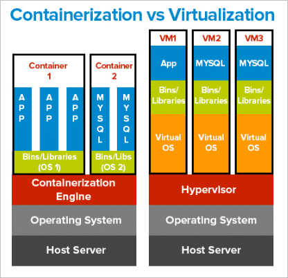
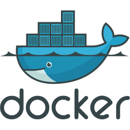
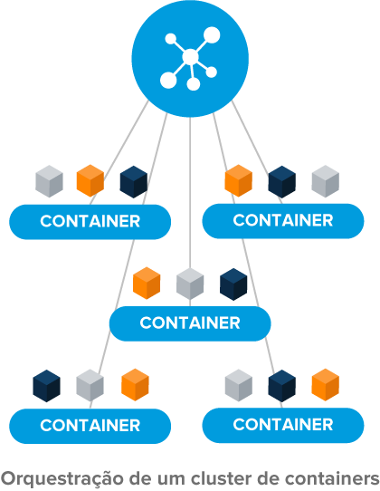

# Desafio de Projeto 3 - Bootcamp de Linux

## Sumário

- [Proposta do Projeto](##Proposta-do-Projeto)
    - [Objetivos do Projeto](###Objetivos-do-Projeto)
    - [Requerimentos do Projeto](###Requerimentos-do-Projeto)
- [Organização do Repositório](##organização-do-repositório)
    - [basic](####basic)
    - [advanced](####advanced)
- [Definições Importantes](##Definições-Importantes)
- [Montando na sua máquina](##Montando-na-sua-Máquina)
- [Observações](##Observações)

------

## Proposta do Projeto

Utilização Prática do Docker no Cenário de Microsserviços

## Objetivos do Projeto

Neste desafio, serão replicadas as aulas ministradas pelo instrutor Denilson Bonatti, criando um repositório próprio e, nesse contexto, conheçer o Docker, implementar uma estrutura de Microsserviços, com as melhores práticas do mercado internacional, e ganhar independência entre aplicações e infraestrutura.

------

## Organização do repositório

### **Projeto Básico**

Na pasta /basic estão os script que seguirão estritamente aquilo que foi proposto pelo desafio, com todos os arquivos necessários para realizar a configuração manual do serviço seja em VMs ou na AWS.

Como treino, arquivos foram digitados exatamente como instruído pelo professor.

### **Projeto Avançado**

Na pasta /advanced está contido todos os arquivos para a execução avançada do projeto, que utiliza muita lógica para permitir a generalização e automatização do projeto básico para qualquer caso semelhante, e uma estrutura modularizada, permitindo maior flexibilidade, escalabilidade e outras implementações no futuro.

Dentro da respectiva pasta há um outro README.md que explica detalhadamente o que cada arquivo faz.

Para tal, o projeto foi imaginado como uma estrutura para mercado, do saudoso Toshiro Shibakita, grande comercial da zona nobre de Jabuticabal-SP, onde o há um banco de dados que contém os produtos, seus códigos de barras como chave e seu respectivo preço. Cada caixa opera com um contêiner do serviço e quando 'bipa' um produto, faz a requisição que adquire seu preço.

------

## Definições Importantes

### **Contêiners e Docker**

Os contêineres para aplicações são uma forma de virtualização de sistema operacional que permite a criação de ambientes portáteis para execução de aplicativos. Eles fornecem uma maneira de isolar e executar aplicativos de maneira consistente e confiável em diferentes ambientes de hospedagem, independentemente do sistema operacional ou configuração do host.

O Docker é uma plataforma de software que usa contêineres para executar aplicativos de forma isolada e portátil. Ele permite que os desenvolvedores criem, implantem e executem aplicativos de maneira rápida e fácil, independentemente do ambiente de hospedagem.

Com o Docker, os desenvolvedores podem criar imagens que contêm todas as dependências necessárias para executar um aplicativo. Essas imagens podem ser facilmente distribuídas e implantadas em qualquer ambiente de hospedagem que suporte contêineres Docker, tornando o processo de desenvolvimento e implantação mais fácil e rápido.

As imagens Docker são criadas usando arquivos de configuração chamados Dockerfiles, que contêm instruções sobre como criar um contêiner. Cada contêiner é uma instância de um sistema operacional mínimo e contém apenas os componentes necessários para executar o aplicativo.

Dessa forma, o Docker permite que os desenvolvedores se concentrem na criação de aplicativos, sem se preocuparem com a complexidade do ambiente de hospedagem. Ele é uma ferramenta popular para criação e implantação de aplicativos, especialmente em ambientes de nuvem, como Amazon Web Services, Google Cloud Platform ou Microsoft Azure.

------

### **Orquestração de contêineres e Docker Swarm**

A orquestração de contêineres é a capacidade de gerenciar, implantar e dimensionar automaticamente um grande número de contêineres em um ambiente de contêiner distribuído. Isso envolve o gerenciamento do ciclo de vida de cada contêiner, desde a criação até a implantação e destruição, e a alocação de recursos, como CPU, memória e armazenamento.

O Docker Swarm é uma ferramenta de orquestração de contêineres que permite criar um cluster de hosts Docker, permitindo a execução de aplicativos em um ambiente de contêiner escalável e altamente disponível. Com o Docker Swarm, é possível definir uma série de serviços em um arquivo de composição do Docker e distribuí-los automaticamente entre os hosts do cluster, gerenciando o agendamento e o balanceamento de carga dos serviços.

O Docker Swarm usa um algoritmo de consenso RAFT para gerenciar o estado do cluster e garantir a tolerância a falhas. Ele pode escalar automaticamente aplicativos em resposta a picos de demanda e garantir a disponibilidade de aplicativos críticos. Além disso, ele oferece recursos de segurança e gerenciamento de recursos, como autenticação e autorização baseadas em certificados TLS e gerenciamento de limites de recursos para controlar o uso de CPU e memória em um ambiente compartilhado.

Com esses recursos, o Docker Swarm é uma ferramenta poderosa para implantar e gerenciar aplicativos em ambientes de contêiner distribuído. Ele pode ser integrado com outras ferramentas de orquestração, como Kubernetes, para criar soluções de contêineres mais complexas e escaláveis.

------

### **Nuvem pública e AWS**

A nuvem pública é um modelo de computação em nuvem em que os recursos computacionais são fornecidos por provedores de serviços de nuvem terceirizados, como a AWS, em vez de serem gerenciados internamente por uma organização. Os serviços em nuvem pública são geralmente fornecidos por meio da Internet e oferecem recursos sob demanda, como armazenamento, processamento e rede, para usuários em todo o mundo.

AWS significa Amazon Web Services, é uma plataforma de computação em nuvem fornecida pela Amazon.com. Ela oferece um conjunto de serviços que ajudam indivíduos e empresas a armazenar, gerenciar e processar dados em uma infraestrutura remota segura e escalável.

Os serviços da AWS incluem, mas não se limitam a: armazenamento em nuvem (S3), bancos de dados (RDS), computação (EC2), rede (VPC), Internet das Coisas (IoT), aprendizado de máquina (Machine Learning), análise de dados (EMR), ferramentas de desenvolvimento (CodeCommit, CodeBuild, CodePipeline), segurança e conformidade, entre outros.

A plataforma AWS é altamente flexível e personalizável, permitindo que os usuários selecionem os serviços necessários para suas necessidades específicas e paguem apenas pelos recursos utilizados, sem a necessidade de se preocupar com investimentos em infraestrutura e hardware próprios. Além disso, a AWS oferece suporte ao desenvolvimento e implantação de aplicativos em várias linguagens de programação e sistemas operacionais.

------

### **Proxy Reverso e NGINX**

Um proxy reverso é um servidor intermediário que recebe solicitações de clientes e encaminha essas solicitações para um ou mais servidores de origem. Diferentemente de um proxy normal, que encaminha solicitações para um cliente, um proxy reverso encaminha solicitações para um servidor, funcionando como um intermediário entre os clientes e os servidores de origem.

O uso de um proxy reverso pode ajudar a distribuir a carga entre vários servidores e fornecer serviços adicionais, como autenticação, balanceamento de carga e caching.

O Nginx (pronuncia-se "engine-x") é um servidor web de código aberto que pode ser usado como um servidor proxy reverso, balanceador de carga, servidor de correio eletrônico e servidor de streaming de mídia. Ele foi criado por Igor Sysoev em 2002 com o objetivo de resolver problemas de escalabilidade do Apache em um ambiente de alta carga.

Uma das principais características do Nginx é sua capacidade de lidar com muitas conexões simultâneas, tornando-o uma escolha popular para sites de alta demanda. Ele é capaz de lidar com milhares de conexões simultâneas com baixo consumo de recursos do sistema.

Além disso, o Nginx tem uma arquitetura modular, permitindo que os usuários adicionem funcionalidades adicionais através de módulos externos. Ele também tem uma configuração simples e flexível, permitindo que os administradores de sistema personalizem facilmente a configuração do servidor de acordo com suas necessidades específicas.

------

### **Load test (Teste de carga) e Locust**

Um load test (teste de carga, em português) é um tipo de teste de software que visa avaliar a capacidade de um sistema ou aplicação para lidar com cargas de trabalho específicas. O objetivo é medir a capacidade de resposta e o desempenho do sistema ou aplicação sob uma carga de trabalho simulada e, em seguida, identificar os gargalos e limitações do sistema.

Um load test pode ajudar a identificar problemas relacionados a capacidade de recursos, como memória, CPU, largura de banda, I/O de disco e conexões de rede, bem como gargalos de software, como problemas de concorrência e problemas de escalabilidade.

Os resultados do load test geralmente incluem métricas como tempo de resposta, taxa de transferência, utilização de recursos do sistema, tempos de espera, erros e outros. Essas métricas podem ser usadas para identificar problemas de desempenho, bem como para otimizar e ajustar o sistema para melhorar o desempenho.

Locust é uma ferramenta de teste de carga de software de código aberto, escrita em Python. Ele permite que os desenvolvedores criem e executem testes de carga para medir a capacidade de um sistema para lidar com uma carga simulada de usuários. O Locust é capaz de gerar um grande número de usuários simulados em uma máquina para testar o desempenho de um sistema em diferentes cenários de carga.

Os testes de carga podem ser personalizados usando o Locust, o que significa que os usuários podem criar cenários de teste personalizados para simular diferentes condições de uso, tipos de usuários e comportamentos. O Locust suporta vários protocolos, incluindo HTTP, HTTPS, WebSockets e mais, permitindo testar aplicativos da web, API's e sistemas em geral.

Além disso, o Locust oferece uma interface da web amigável para que os usuários possam monitorar o desempenho do sistema em tempo real durante o teste. A interface do usuário permite que os usuários visualizem métricas importantes, como o tempo de resposta, o número de solicitações bem-sucedidas e malsucedidas, a taxa de transferência e muito mais. Isso permite que os usuários detectem gargalos e outros problemas de desempenho enquanto os testes estão sendo executados.

------

## Montando na sua máquina

Leia as observações (próxima seção) antes de seguir com a montagem.

Para utilizar os scripts na sua própria máquina, você pode fazer o seguinte (em 8 todos os comandos são concatenados para facilitar):

0 - Logue como super usuário, isso facilitará o processo da criação da infraestrutura. Ao encerrar, saia do usuário root por questões de segurança.

    sudo su

1 - Vá para a raiz e, caso ainda não tenha uma pasta para receber o conteúdo, crie uma (ex: downloads)

    cd /
    mkdir downloads
    cd downloads

2 - Caso sua máquina não tenha o apt unzip, o instale por meio de:

    apt-get install unzip

3 - Faça o download dos arquivos necessários no GitHub:

    wget https://github.com/jhonesaly/project_iac3/archive/refs/heads/main.zip

4 - Descompacte o arquivo baixado.

    unzip main.zip

5 - Atribua a possibilidade de ler, editar e executar os arquivos na pasta extraída:

    chmod -R 771 project_iac3-main

6 - Tudo pronto. Se quiser configurar tudo manualmente, vá para a pasta /basic. Se quiser rodar o script avançado (porém mais fácil de implementar) Siga para a pasta /advanced e execute o shell script da pasta.

    cd project_iac3-main
    cd advanced
    ./new_iac3.sh

7 - Você pode, antes de rodar o script, configurar diretamente o arquivo de configurações. Para tal, na pasta /advanced use o seguinte comando e adicione os valores manualmente.

    nano master_vars.conf

8 - Comandos compilados para facilitar (basta copiar tudo, colar e executar no terminal):

    cd /
    mkdir downloads
    cd downloads
    apt-get install unzip
    wget https://github.com/jhonesaly/project_iac3/archive/refs/heads/main.zip
    unzip main.zip
    chmod -R 771 project_iac3-main
    cd project_iac3-main
    cd advanced
    ./new_iac3.sh

------

## Observações

- O tutorial de montagem leva em consideração que também está sendo utilizada uma máquina Linux
- Os scripts não foram testados em todas as distribuições Linux existentes. Recomenda-se teste em um ambiente controlado antes de utilizá-lo em produção.
- A ideia é que o script permita que uma pessoa leiga em programação consiga criar a infraestrutura sem abrir o código, mas mesmo o script básico pode ser utilizado por um programador para criar manualmente aquilo que deseja alterando os parâmetros no código.

[Voltar ao topo](#sumário)
