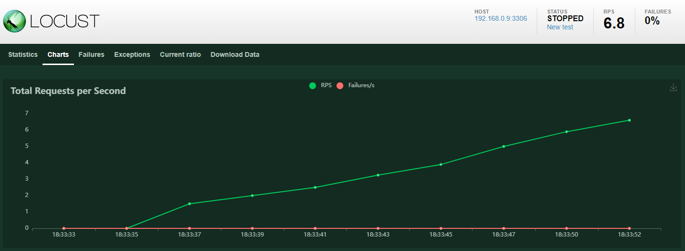

# project_iac3/advanced

Nessa pasta está contida o script avançado, que utiliza lógica para permitir a generalização do script básico para qualquer caso semelhante.

Tudo isso utilizando uma estrutura modularizada que permite maior flexibilidade e mais implementações no futuro.

Para tal, basta executar o script "new_iac3.sh".

O script é responsável por conduzir o usuário por um conjunto de perguntas iniciais que ajudarão a configurar a aplicação.

------

## Mapa de pastas do projeto

main
└── advanced
    ├── master_vars.conf
    ├── new_iac.sh
    ├── README.md
    └── modules
        ├── create_leader.sh
        ├── create_worker.sh
        ├── app
        │   ├── clean_docker.sh
        │   ├── direct_rand_insert.py
        │   ├── dockerfile
        │   ├── index.py
        │   ├── locust_loadtest.py
        │   └── rand_insert_shell.py
        ├── database
        │   └── dbscript.sql
        └── proxy
            ├── dockerfile
            └── nginx.conf

/advanced/modules/app: contém todos arquivos da aplicação
/advanced/modules/database: contém todos arquivos referentes ao banco de dados
/advanced/modules/app: contém todos arquivos referentes ao proxy

------

## Explicando o script "new_iac3.sh"

Na etapa 0, são definidas algumas variáveis de cor para as mensagens que serão impressas na tela. Em seguida, uma mensagem de boas-vindas é impressa na tela com o nome do protocolo a ser executado e um link para a documentação do projeto.

### Configuração

Na etapa 1, o script faz algumas perguntas ao usuário para configurar o cluster. O número da pergunta é armazenado na variável 'question_number'.

A pergunta número 1 pergunta se o usuário deseja criar um líder (gerenciador do cluster) no cluster. Se a resposta for "y", o script faz outra pergunta se o usuário deseja usar um arquivo de configuração pré-existente, o **master_vars.conf**. Se a resposta for "n", o script faz várias perguntas ao usuário para configurar o líder, que são salvas no arquivo de configuração, o sobrescrevendo.

Se a pergunta número 1 for respondida com "n", o script passa para a pergunta número 2, que pergunta se o usuário deseja criar um worker (serviço secundário) no cluster.

Se o usuário responder a pergunta que preenche a variável 'ans_a1' e 'ans_b1' inadequadamente, cai em um loop que continua até que todas as perguntas sejam respondidas. Se as respostas forem "y" ou "n", o loop termina.

#### master_vars.conf

O arquivo .conf é um arquivo de configuração que define as variáveis utilizadas no programa. Nesse caso, as variáveis definidas no arquivo .conf são:

- 'ans_a1': variável booleana que indica se deve ser criado um líder.
- 'ans_a2': variável booleana que indica se deve ser criados dados aleatórios.
- 'db_name': variável que define o nome do banco de dados.
- 'root_name': variável que define o nome do administrador do banco de dados.
- 'root_pass': variável que define a senha do administrador do banco de dados.
- 'master_ip': variável que define o endereço IP do líder do serviço.
- 'n_rand_data': variável que define a quantidade de dados aleatórios que serão gerados.
- 'n_cont': variável que define o número de containers do serviço.

### Módulos

A etapa 2 executa os módulos apropriados com base nas respostas do usuário. Se a resposta para a pergunta número 1 for "y", o módulo **create_leader.sh** é executado para criar um líder no cluster.

Se a resposta para a pergunta número 1 for "n" e a resposta para a pergunta número 2 for "y", o módulo **create_worker.sh** é executado para criar um worker no cluster.

Se a segunda pergunta com '[y/n]' dentro da configuração do leader for 'y', executa a inserção de dados aleatórios no banco de dados usando um script Python **rand_insert_shell.py**.

Se a resposta para a pergunta número 1 for "n" e a resposta para a pergunta número 2 também for "n", o script passa para a finalização.

Na última etapa, o script imprime uma mensagem de finalização na tela.

A seguir, serão explicados os scripts dos módulos.

------

## Explicando o script "create_leader.sh"

Esse é um script em Bash que executa uma série de comandos para configurar um cluster de Docker para uma aplicação web e seu respectivo manager.

### 0 - Configurações

Este bloco puxa as variáveis do arquivo **master_vars.conf** que é lido para que as variáveis root_name, root_pass e db_name possam ser usadas em outras partes do script. 

Em seguida, são instalados alguns pacotes e imagens importantes para a execução do código.

Depois, é criado um volume para o banco de dados, um para a aplicação e outro para o proxy.

Por fim, é iniciado o Docker Swarm e são criados tokens de worker e manager, que são adicionados no arquivo **master_vars.conf** para que possam ser usados em outras máquinas e adicionadas ao cluster.

### 1 - Banco de dados

Este bloco cria um contêiner para o banco de dados MySQL e executa um script SQL nele e guarda o ID do contêiner MySQL na variável 'mysql_container_id'.

com o contêiner criado, o tudo que está na pasta /modules/database, que nesse projeto só contém o **dbscript.sql**, é copiado para o diretório do volume do banco de dados.

Em seguida, uma função é definida para executar o script no banco de dados no contêiner. Essa função é usada em um loop até que o comando seja executado com sucesso.

A função foi criada pois, muitas vezes, ao rodar o script, aparece o seguinte erro:

    ERROR 2002 (HY000): Can't connect to local MySQL server through socket '/var/run/mysqld/mysqld.sock' (2)

Mas, em geral, basta reexecutar o comando para que funcione.

#### dbscript.sql

O script SQL cria uma tabela chamada "estoque". A tabela tem seis colunas: "id_codigo_barras", "nome", "marca", "preco", "data_compra" e "data_validade".

A primeira coluna "id_codigo_barras" é definida como um tipo de dados VARCHAR com um comprimento máximo de 13 caracteres e é declarada como NOT NULL, o que significa que um valor deve ser fornecido ao inserir um registro na tabela.

A segunda coluna "nome" é definida como um tipo de dados VARCHAR com um comprimento máximo de 50 caracteres e também é declarada como NOT NULL.

A terceira coluna "marca" é definida como um tipo de dados VARCHAR com um comprimento máximo de 50 caracteres e é declarada como NOT NULL.

A quarta coluna "preco" é definida como um tipo de dados DECIMAL com um tamanho máximo de 10 e uma precisão máxima de 2, o que significa que o preço pode ter até 10 dígitos no total, com 2 casas decimais. A coluna é declarada como NOT NULL.

A quinta coluna "data_compra" é definida como um tipo de dados DATE e é declarada como NOT NULL.

A sexta coluna "data_validade" é definida como um tipo de dados DATE e também é declarada como NOT NULL.

Por fim, a tabela tem uma chave primária, que é a coluna "id_codigo_barras". Isso garante que cada registro na tabela tenha um valor exclusivo para essa coluna.

### 2 - Proxy

Esse trecho de código é responsável por configurar o proxy reverso do servidor nginx para balanceamento de carga, criando um container que distribui o tráfego entre os diferentes nós (manager e workers) do cluster.

O primeiro bloco de código cria a imagem nginx_ready a partir do arquivo **dockerfile** e do arquivo de configuração **nginx.conf**, que é modificado para incluir o IP do nó master (leader) e posteriormente copiado para o diretório /var/lib/docker/volumes/proxy_volume/_data.

Em seguida, o comando "docker build" cria a imagem a partir do diretório corrente e a tag "nginx_ready" é atribuída.

O segundo bloco de código cria o container nginx_proxy a partir da imagem criada anteriormente, usando o comando "docker run". O container é iniciado com a opção "-p" que mapeia a porta 4500 do host para a porta 4500 do container, e a opção "-v" que monta o volume "proxy_volume" no diretório "/var/lib/docker/volumes/proxy_volume/_data" dentro do container. A opção "--restart always" configura o container para reiniciar automaticamente em caso de falhas. 

Depois disso, o comando "sleep" aguarda 30 segundos para garantir que o container esteja funcionando corretamente.

O terceiro bloco de código cria um loop (worker inspect) que detecta se novos nós (workers) foram adicionados ao cluster.

O comando "docker node ls" lista todos os nós do cluster e o comando "docker node inspect" obtém o status de cada nó. O número de nós com status "ready" é contado com o comando "grep -c 'ready'". Se o número de nós "ready" for diferente do número de nós detectados na iteração anterior, isso significa que um novo nó foi adicionado ao cluster.

Nesse caso, o container "nginx_proxy" é parado e removido com o comando "docker stop" e "docker rm", respectivamente.

O novo endereço IP do worker recém-adicionado é obtido do arquivo "/shared/ip_list.conf", que é atualizado constantemente com o endereço IP de cada nó do cluster e via NFS, que será configurado mais adiante.

O arquivo de configuração **nginx.conf** é novamente modificado para incluir o novo IP, e a imagem nginx_ready é reconstruída com o comando "docker build".

Um novo container "nginx_proxy" é criado com o mesmo comando "docker run" usado anteriormente, e o loop é reiniciado (e fica rodando em segundo plano) para detectar novas adições ao cluster.

Por fim, fora do loop, o último bloco de código cria um diretório "/shared" e um arquivo **ip_list.conf** dentro dele, que armazena a lista de IPs dos nós do cluster.

O arquivo **master_vars.conf** também é copiado para o diretório "/shared", pois é necessário para inserção do novo nó no cluster.

#### nginx.conf e dockerfile

O arquivo nginx.conf é a configuração do servidor proxy Nginx. É dividido em duas seções principais: http e events.

A seção http define as configurações para o protocolo HTTP. A primeira diretiva upstream define um grupo de servidores backend que serão balanceados pelo Nginx. A diretiva server define a configuração do servidor Nginx. A diretiva listen define a porta em que o servidor Nginx irá escutar. A diretiva location define a rota que o Nginx irá manipular e o proxy_pass define o grupo de servidores backend balanceados pela diretiva upstream.

O arquivo Dockerfile é usado para construir uma imagem Docker customizada com o Nginx e a configuração do nginx.conf. O FROM define a imagem base usada como ponto de partida para construir a nova imagem. A diretiva COPY copia o arquivo nginx.conf da pasta atual para a pasta /etc/nginx/ dentro da imagem.

### 3 - Aplicação

Esse trecho de código faz a construção da imagem do Docker para a aplicação em Python, configura as variáveis de ambiente necessárias para a execução da aplicação e cria um serviço no Docker Swarm.

Primeiro, ele navega até o diretório modules/app e adiciona as variáveis de ambiente MASTER_IP, DB_NAME, ROOT_PASS e N_RAND_DATA ao arquivo **dockerfile**. Em seguida, ele usa o comando docker build para criar uma imagem com o nome python_ready.

Depois, o script copia todos os arquivos da pasta /app para o volume da aplicação app_volume usando o comando cp -r. Em seguida, ele cria um serviço no Docker Swarm com o nome python_app_service, que é responsável por executar a aplicação em Python.

O serviço é criado usando o comando docker service create, usando a imagem configurada e demais variáveis puxadas do **master_vars.conf** e especifica que deve ser montado um volume no diretório /var/lib/python dentro do contêiner para que os arquivos necessários da aplicação estejam disponíveis.

Finalmente, o script adiciona um sleep 30 para permitir que o serviço da aplicação seja iniciado antes de continuar com a execução do restante do script.

### 4 - Compartilhamento

Essa parte dp código configura o NFS (Network File System) para compartilhar os arquivos entre diferentes máquinas.

O trecho de código adiciona dois diretórios para compartilhamento de arquivos: /var/lib/docker/volumes/app_volume/_data e /shared no arquivo exports na pasta /etc.

Os parâmetros *(rw,sync,subtree_check) especificam as permissões de acesso ao diretório compartilhado. Em particular, rw permite que os clientes possam ler e escrever no diretório, sync garante que as alterações sejam sincronizadas entre o cliente e o servidor em tempo real e subtree_check permite que o sistema de arquivos seja verificado recursivamente para garantir a integridade dos arquivos compartilhados.

Depois, executa o comando exportfs -ar para tornar os diretórios compartilhados disponíveis para as máquinas clientes.

Por fim, o comando systemctl restart nfs-kernel-server reinicia o serviço NFS no servidor para aplicar as configurações atualizadas.

------

## Explicando o script "create_worker.sh"

Esse é um script em shell que executa uma série de ações em um servidor para adicionar um novo nó worker em um cluster Docker Swarm. Acaba sendo mais simples que os demais pois já tem muita coisa pronta, então só precisa puxar e montar.

### 0 - Configurações

Nesta seção, todas as variáveis citadas anteriormente são puxadas pelo **master_vars.conf** para utilização no código.

Depois, os pacotes necessários são instalados no servidor. Isso inclui o Docker, o NFS, e outras dependências.

### 1 - Compartilhamento

Nesta seção, primeiro é criado o volume no docker para receber o conteúdo da aplicação, e então o compartilhamento NFS é configurado para que a pasta /var/lib/docker/volumes/app_volume/_data e a pasta /shared possam ser acessadas a partir do leader.

### 2 - Cluster

Primeiro, o script copia o arquivo de variáveis de ambiente /shared/master_vars.conf para atualizá-lo caso tenha havido alguma mudança e acessar o token para worker, em seguida, executa o comando docker swarm join para adicionar o nó worker.

Por fim, ele coleta o endereço IP do novo nó worker e adiciona-o a um arquivo ip_list.conf que pode ser usado para controlar o status dos nós do cluster.

Assim que ele entra no cluster, o 'worker inspect' do leader, que está rodando em segundo plano, identifica a alteração na quantidade de nós e reinicia o proxy com o novo worker.

------

## Explicando o script "rand_insert.py" e suas variações

Os scripts direct_rand_insert.py, rand_insert_shell.py e index.py são todos variações do mesmo código. O primeiro é param diretamente inserir produtos aleatórios no banco de dados, o segundo insere durante a execução do script da criação da infraestrutura e o último insere os produtos aleatórios via HTTP request para o proxy.

O último é o único não funcional por estar muito fora do escopo do projeto, mas poderá ser implementado no futuro.

Para referência, será explicado o funcionamento do _shell pois é o que será executado durante a criação da infraestrutura.

### rand_insert_shell.py

O script é usado para gerar dados aleatórios para inserir em um banco de dados MySQL. 

As bibliotecas 'os', 'random', 'sys' e 'datetime' são importadas.

A função name_rand() é definida. Esta função gera um nome aleatório, combinando aleatoriamente consoantes e vogais para criar sílabas e, em seguida, capitaliza a primeira letra do nome gerado.

A função date_rand() é definida. Esta função gera uma data aleatória dentro de um intervalo de datas pré-definido. A data gerada é retornada no formato YYYY-MM-DD.

Os argumentos passados ao script a partir do **new_iac3.sh** são atribuídos a variáveis Python. Esses argumentos são o endereço IP do servidor MySQL mestre ('master_ip'), o nome do banco de dados ('db_name') que será usado, a senha root ('root_pass') para o servidor MySQL e o número de dados aleatórios a serem gerados ('n_rand_data').

As variáveis host, user, password e database são definidas com base nos argumentos fornecidos.

Uma conexão é criada ao banco de dados MySQL usando a função pymysql.connect().

O loop for é executado 'n_rand_data' vezes, inserindo dados aleatórios na tabela estoque no banco de dados.

Para cada iteração do loop for, um código de barras aleatório, nome aleatório, marca aleatória, preço aleatório, data de compra aleatória e data de validade aleatória são gerados usando as funções name_rand() e date_rand(). O código de barras e o preço gerados são exibidos na saída padrão para fins de teste.

A string SQL para inserir os dados gerados na tabela estoque é criada na variável query.

A instrução SQL é executada no banco de dados usando a função cursor.execute(query).

As alterações são confirmadas no banco de dados usando conn.commit().

Quando o loop for é concluído, a conexão com o banco de dados é encerrada usando conn.close().

A mensagem "Novo registro com sucesso." é exibida na saída padrão.

### direct_rand_insert.py

A principal diferença entre esse e o anterior é que o esse verifica se a biblioteca pymysql está instalada antes de usá-la e, se não estiver, instala-a automaticamente. Isso é feito usando o módulo pkgutil para verificar se a biblioteca está disponível e o módulo subprocess para instalar a biblioteca usando o comando pip.

Além disso, solicita ao usuário as informações do banco de dados, como o IP da máquina, o nome do banco de dados e a senha do usuário root.

Outra diferença é que o novo código usa a sintaxe with conn.cursor() as cursor: para gerenciar o cursor do banco de dados, o que é uma prática recomendada para garantir que o cursor seja fechado automaticamente após a execução da consulta.

------

## Explicando o script "locust_loadtest.py"

Esse script utiliza a biblioteca Locust para realizar testes de carga em um banco de dados MySQL.

O script começa verificando se as bibliotecas necessárias estão instaladas e, caso não estejam, as instala. Em seguida, define uma função mysql_test que realiza uma consulta SQL simples no banco de dados e retorna o resultado. Essa função será utilizada para criar a tarefa de teste em si.

A classe MyUser é criada como um bot de teste (que seria um caixa do mercado), que define uma tarefa a ser executada. A tarefa é a função mysql_task, que chama a função mysql_test com parâmetros específicos e envia o resultado para o gráfico do Locust. A tarefa é definida para ser executada entre 1 e 2 segundos de espera (estimado como a máxima velocidade de um caixa operando o leitor de código de barras), simulando um comportamento de usuário real.

Por fim, o script define como rodar a interface do Locust, especificando o arquivo que contém as tarefas (-f), o número de usuários virtuais (-u), a taxa de geração de usuários virtuais (-r), o tempo total de execução (-t) e o endereço do banco de dados a ser testado (--host).

Ao rodar o script, será aberta uma interface web do Locust que permitirá monitorar o andamento dos testes, incluindo informações sobre número de usuários, taxa de requisições por segundo, tempo de resposta, entre outras métricas.

Para verificar o container, basta colocar a porta em que ele está conectado, para testar a rede, use a porta 4500, que foi definida como porta do proxy no script da infraestrutura.

------

## Explicando o script "clean_docker.sh"

**Atenção**, esse script é potencialmente perigoso e não deve ser utilizado em ambiente de produção, somente para testes.

Este script shell é usado para remover todos os recursos do Docker que foram criados anteriormente, incluindo containers, serviços, redes e imagens, e também remove o nó do cluster do Swarm.

Facilita a realização de outros testes com docker sem ter que voltar para um snapshot anterior da VM.

Explicação dos comandos:

- docker rm -f $(docker ps -aq): este comando remove todos os containers existentes.
- docker service rm $(docker service ls -q): este comando remove todos os serviços do Docker que estão em execução.
- docker network rm $(docker network ls -q): este comando remove todas as redes Docker existentes.
- docker rmi -f $(docker images -aq): este comando remove todas as imagens Docker existentes.
- docker swarm leave --force: este comando remove o nó atual do Docker Swarm cluster. O --force é usado para forçar a saída do nó mesmo se ele ainda estiver em execução.